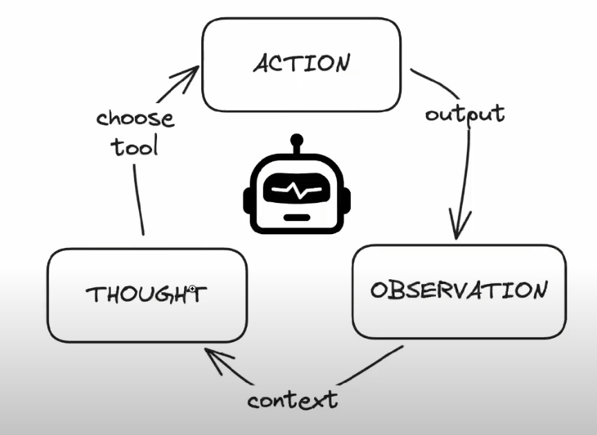
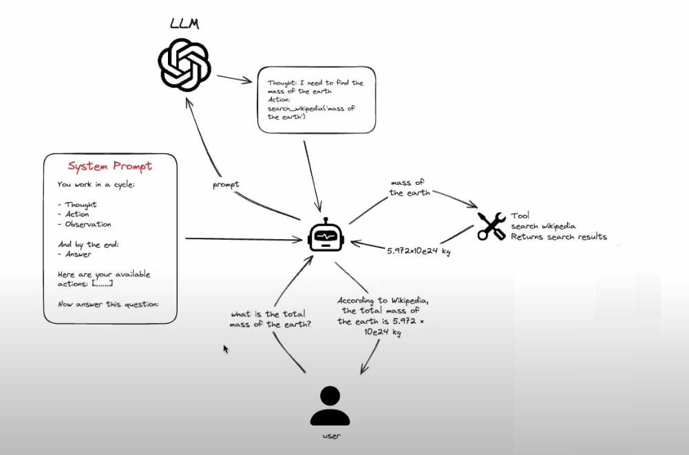

# ReAct AI Agent with Thought-Action-Observation Loop

This project is a simple AI agent that follows a **Thought → Action → Observation** loop to answer user queries. It uses the **Groq API** for LLM-based decision-making and can interact with tools like Wikipedia search.

## How It Works

1. **Thought**: The agent decides what action to take.
2. **Action**: Executes the chosen tool (e.g., searches Wikipedia).
3. **Observation**: Reads the tool's output and refines its response.
4. **Answer**: Gives the final response to the user.

### Example

- **User asks**: "What is the total mass of the Earth?"
- **Agent thinks**: "I need to find the mass of the Earth."
- **Agent acts**: Searches Wikipedia.
- **Agent observes**: Finds "5.972 × 10^24 kg."
- **Agent responds**: "The total mass of the Earth is 5.972 × 10^24 kg."

  
  

## Technologies Used

- **Groq API** (LLM for reasoning)
- **Python** (Backend logic)
- **React.js** (Frontend UI)
- **dotenv** (Environment variable management)

## Setup & Installation

1. **Clone the Repository**  
   ```
   git clone https://github.com/your-username/ReAct-AI-Agent.git  
   cd ReAct-AI-Agent
   ```

2. **Install Dependencies**  
   ```
   pip install -r requirements.txt  
   cd frontend && npm install
   ```  

3. **Set Up API Key**  
   Create a `.env` file and add:  
   ```
   GROQ_API_KEY=your_api_key_here
   ```

